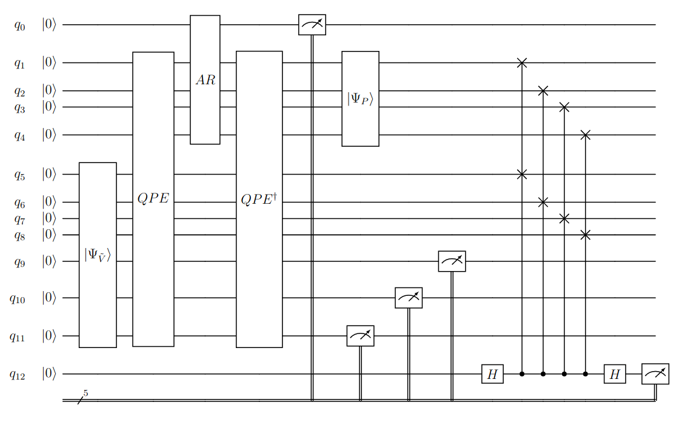

# Quantum algorithm for linear systems of equations for the multi-dimensional Black-Scholes equations - Eddie Kelly, 2024.

### https://mural.maynoothuniversity.ie/id/eprint/19288/

## Author's information:

### https://www.maynoothuniversity.ie/people/eddie-kelly
### https://www.linkedin.com/in/eddie-kelly-qc-maynooth/

### Abstract

#### *The primary focus of this thesis is the investigation of the quantum algorithm for linear systems of equations (HHL) for the valuation of multi-asset options, a particular type of financial instrument. Quantum computing has the possibility to revolutionize many fields that are computationally intensive, such as quantitative finance. We extend the previous works on quantum solutions to the Black-Scholes equation for option pricing and provide its proof-of-principle implementation. We transform the problem of pricing a multi-asset option into a system of linear equations and employ the quantum algorithm due to Harrow, Hassidim and Lloyd to find its solution. Certain numerical characteristics of the matrix representing the system of linear equations determine a vital role in whether computational advantage can be achieved. The central question of this thesis is whether we can perturb the matrix that is to be inverted in the direction of more favourable numerical characteristics without compromising the accuracy of the final solution in representing the present value of the multi-asset option. Through specific examples, we show that this perturbation does not compromise the accuracy of the calculated value for the option. After an introduction to options and their underlying mathematical description, we provide a derivation for the Black-Scholes equation using stochastic calculus and its corresponding solution for the vanilla European option through the Feynman-Kac formula. We continue with the numerical methods of finite difference approximations to convert the problem into a system of linear equations. Finally, after presentation of the quantum algorithm, we proceed with numerical simulations to determine (a) whether the aforementioned perturbation can be ameliorated with modified boundary conditions and (b) whether a working end-to-end quantum algorithm for option pricing for the case of a single-asset European option maybe achieved. Our simulation provides a proof-of-principle demonstration of the quantum algorithm*.

This code was produced during the completion of master's thesis research on the application
of the HHL or quantum algorithm for linear systems of equations to quantitative pricing of
multi-asset options. This repo is broadly broken into three distinct directories. 
 
